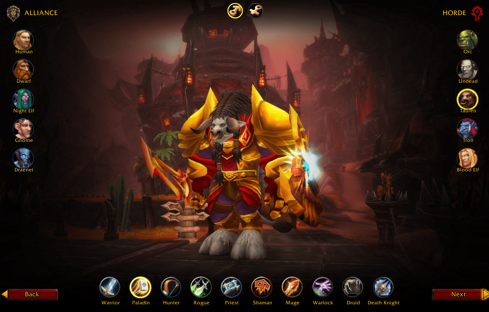

# Unlock All Classes (mod-uac)

An AzerothCore (WotLK 3.3.5a) module that lets **any race play any class**, including the
combinations Blizzard never shipped: Tauren Paladin, Human Shaman, Blood Elf Warrior, and more.

Stock AzerothCore allows **62** race/class pairs. mod-uac adds **38** more, for all **100**
playable tiles on the character creation screen.



Everything the module does is revertable, and every file it ships is either human-readable
SQL or generated from known sources. No mystery binaries on your server.

## Requirements

- AzerothCore WotLK 3.3.5a, with the ability to rebuild the server (standard module workflow)
- Access to the client `Data/` folder of anyone connecting to your server (one small patch file)

## Install

### 1. Add the module and rebuild

```bash
cd /path/to/azerothcore-wotlk/modules
git clone https://github.com/berubejd/mod-uac.git
```

Re-run CMake and rebuild, then restart as usual. The default module build (`MODULES=static`)
picks up all `modules/mod-*` directories automatically.

On the next **worldserver** start, AzerothCore's database updater automatically applies the
module's SQL. No manual database steps are needed.

### 2. Set one config value

In `worldserver.conf`:

```ini
PlayerStart.CustomSpells = 1
```

Stock AzerothCore defaults this to `0`. Without it, Night Elf and Draenei Warlocks are created
**without** Summon Imp, and the optional level-1 hunter pet feature won't work.

### 3. Install the client patch

Pick **one** of the three checked-in patch files based on your client:

| Your client | Use this file |
|-------------|---------------|
| Official **HD** 3.3.5a client | `client-patch/enhanced/patch-z.mpq` |
| Stock / reference 3.3.5a client | `client-patch/standard/patch-z.mpq` |
| Heavily customized client (custom outfit or DBC patches) | `client-patch/unlock-only/patch-z.mpq` |

Copy it into the client's `Data/` folder, keeping the name:

```text
client-patch/enhanced/patch-z.mpq  ->  <WoW>/Data/patch-z.mpq
```

Two gotchas:

- **If `patch-z.mpq` is already taken**, rename the mod-uac file to any free
  `patch-<letter>.mpq` slot (e.g. `patch-y.mpq`). Names like `patch-uac.mpq` are **not**
  loaded by a stock 3.3.5a client. It must be a single letter.
- **Windows is case-insensitive**: `patch-A.mpq` and `patch-a.mpq` are the same file. Don't
  reuse a letter an existing HD or third-party patch already occupies.

Not sure which patch to pick, or want to know exactly what each one changes? See the
[Operator Guide](docs/operator-guide.md#choosing-a-client-patch).

### 4. Verify it worked

1. Start the worldserver and watch the log. The DB updater should list the `mod_uac_*.sql`
   files on first boot.
2. Log in with the patched client and open character creation. All race/class tiles should be
   selectable.
3. Create an off-race character (e.g. Tauren Paladin). It should have starter gear, a
   starter-zone class trainer, and (for shamans) faction-appropriate totem models.

## If something's wrong

- **New combos don't appear on the creation screen.** The client patch isn't loading. Check
  that the filename is `patch-<single letter>.mpq` and that it's in the right `Data/` folder.
- **Tiles appear but creation is rejected.** The server SQL didn't apply. Check
  the worldserver log for mod-uac updates.
- **Night Elf / Draenei Warlock has no imp.** `PlayerStart.CustomSpells = 1` wasn't set before
  the character was created.
- **Shaman totems are invisible.** `mod_uac_player_totem_model.sql` didn't apply; see the
  server SQL check above.

## Uninstall

1. Run the paired revert files in `data/sql/db-uninstall/` against the **world** database
   (any order; the files are independent).
2. Remove the mod-uac `patch-*.mpq` from the client `Data/` folder.

Existing off-race characters are not deleted; the combos simply stop being creatable.

## Good to know

- New combinations are community expansions, not Blizzard-shipped pairs. Once created they
  play like normal characters.
- Starter class trainers are added to each race's starting zone for the new combos, but some
  class quest chains still require travel to their reference zones. Details in the
  [Operator Guide](docs/operator-guide.md#class-quests).
- An optional extra lets all hunters tame pets at level 1 (later-expansion quality of life).
  If you would like to remove that functionality, please eee the
  [Operator Guide](docs/operator-guide.md#optional-hunter-pets-at-level-1).

## Documentation

| Doc | For |
|-----|-----|
| [Operator Guide](docs/operator-guide.md) | Running mod-uac on customized servers: SQL reference, patch internals, quest policy, custom DBC baselines, trainer overrides |
| [Development Guide](docs/development.md) | Regenerating artifacts, generator tooling, snapshots, QA checklist |
| [Engineering Implementation](docs/mod-uac-engineering-implementation.md) | Full architecture, combo matrix, design rationale, and phasing |